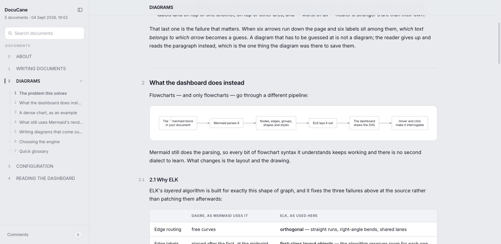
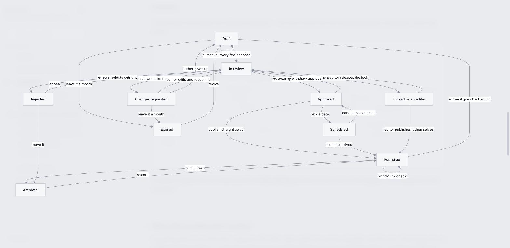
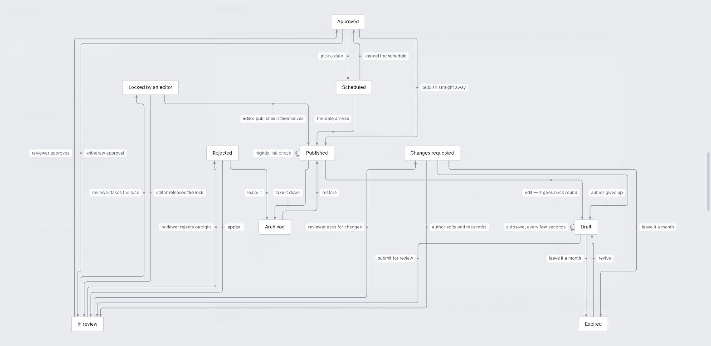
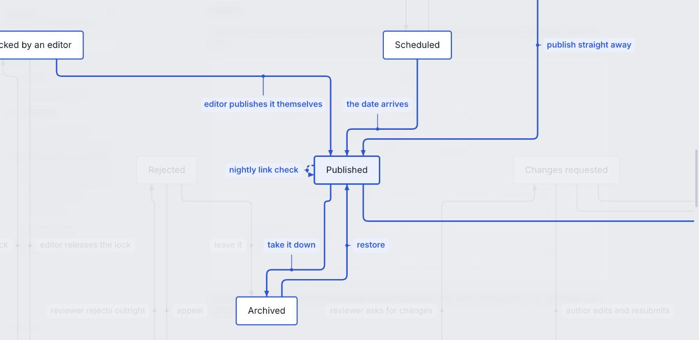
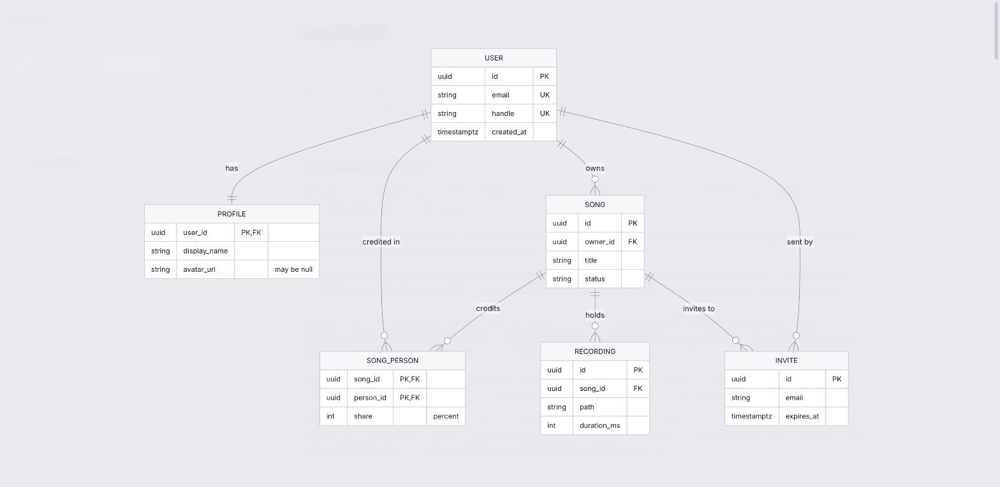
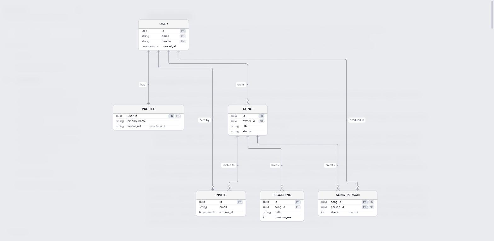

# DocuCane

Turn a folder of Markdown into **one self-contained HTML page** you can open by double-clicking —
and get flowcharts and ER diagrams that stay readable when they get dense.

No server, no dependencies, no build pipeline. One file you can email.



## Quick start

```bash
npx docucane ./docs      # render a folder, zero configuration
npx docucane init        # or wire a project up once, then just `npx docucane`
```

`init` writes a `docs.config.json`, creates the folder if missing, gitignores the output, and
installs the agent files described [below](#for-agents).

Output is `.docucane/index.html` plus a `vendor/` folder. Needs a network connection **once** —
mermaid, ELK and the Inter font are cached on the first build; every build after that is offline.

## Diagrams that stay readable

Mermaid is a great way to *write* a diagram and a poor way to *read* a dense one. Its default
layout routes edges as free curves and drops each label at the middle of its edge with nothing
reserving space for it. Past a dozen transitions, labels collide with each other and with other
arcs, and **you can no longer tell which text belongs to which arrow** — at which point the diagram
has stopped working and the reader falls back to the prose.

Same 10 boxes and 24 labelled transitions, both engines:

| Mermaid's own layout | DocuCane |
|---|---|
|  |  |
| labels overlapping each other and stranded far from their arcs | orthogonal lanes, every label in reserved space, tied to its own arc |

Mermaid still does the **parsing** — every bit of flowchart syntax it understands keeps working,
and there is no second dialect to learn. [ELK](https://eclipse.dev/elk/)'s layered algorithm does
the **layout**: orthogonal edge routing, edge labels as first-class objects the algorithm reserves
room for, and crossing minimisation as a real objective. DocuCane draws the result.

Layout alone still leaves six parallel arcs with six labels beside them, so each label is also
**tied to its arc** by a hairline ending in a dot on that arc — and you can interrogate the chart:



- **Hover an arrow** — the arrow, its text and the boxes at both ends light up; the rest fades.
- **Hover a box** — the box, every arrow touching it, and the box at the far end of each.
- **Click** to pin, **Esc** to release. Works in the full-size view too.

### ER diagrams get the same treatment

Same six entities and seven relationships, both engines:

| Mermaid's own layout | DocuCane |
|---|---|
|  |  |
| every cell boxed, empty ones included, keys as `PK,FK` text in a cell, relationships as curves with the label loose beside them | columns that line up, keys as a column of their own, orthogonal routes, every label tied to its line, crow's feet against the entity |

The entity is drawn as a **table** rather than a grid of boxed cells: the type and the name are
columns measured across the whole entity so they line up, **PK** / **FK** / **UK** are pinned to
the right edge as a column you can run your eye down, and a comment sits in italics after the name.
Cardinality is standard crow's-foot notation, drawn against the entity where it belongs. Hovering
works exactly as above — hover a relationship and both entities light up, hover an entity and you
get everything that touches it.

Everything else (sequence, state, gantt, pie, class) renders through mermaid as before, and mermaid
is the fallback if anything goes wrong. Every diagram carries a button to switch between the two,
so the comparison above is always one click away.

## What else you get

- **A sidebar** of every document, grouped by sub-folder, ordered by the number in the filename
  (`10.` after `9.`, as you meant it).
- **Foldable sections** — every heading owns what follows it, and what you fold is remembered.
- **Links that work in both places.** `[Diagrams](./2.%20DIAGRAMS.md#why-elk)` becomes in-page
  navigation here and still resolves on GitHub — the anchors are GitHub's.
- **Full-size diagrams** with drag-to-pan and scroll-to-zoom.
- **Margin comments** for reading a draft (kept in your browser, not in the repo).
- Search, a section rail, previous/next, and print styles that drop the interface.

## Configuration

Optional. `docs.config.json` at the project root:

```json
{
  "title": "Acme Docs",
  "docs": "documentation",
  "out": ".docucane",
  "diagrams": { "engine": "clean" }
}
```

Every setting and flag: [docs/3. CONFIGURATION.md](./docs/3.%20CONFIGURATION.md).

## For agents

`docucane init` installs into the project's `.claude/`:

| | |
|---|---|
| `commands/docs.md` | `/docs` — render the dashboard and open it |
| `skills/write-doc/` | how to write a document in this house style, and what makes a good diagram |
| `skills/audit-docs/` | a read-only structured audit of the documents |

## Documentation

`docs/` is DocuCane's own documentation — rendering it is the fastest way to see the tool:

```bash
git clone git@github.com:lorebalbo/DocuCane.git && cd DocuCane && node bin/docucane.mjs
```

[0. ABOUT](./docs/0.%20ABOUT.md) · [1. WRITING](./docs/1.%20WRITING.md) ·
[2. DIAGRAMS](./docs/2.%20DIAGRAMS.md) · [3. CONFIGURATION](./docs/3.%20CONFIGURATION.md) ·
[4. READING](./docs/4.%20READING.md)

## Requirements & tests

Node 18+. `npm run check` builds a throwaway folder and asserts the page came out whole.

MIT
