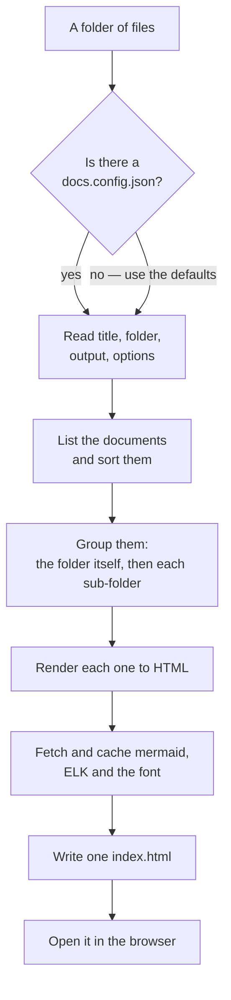

# ABOUT

> DocuCane turns a folder of Markdown into one self-contained page you can open by
> double-clicking it. No server, no build step to learn, no dependencies to install. This
> document explains what it is for and what it is not for; the rest of this folder is the
> reference, and is itself rendered by the tool.

---

## What it is

A folder of Markdown is the cheapest place to keep documentation: it lives beside the code, it
diffs, it reviews, and it renders on any host that understands Markdown. What it is not is
*pleasant to read* — a reader lands in a file tree, opens files one at a time, loses the thread
between them, and gets a static picture instead of a diagram they can actually inspect.

DocuCane is the reading half. It takes the folder as it stands, changes nothing in it, and
writes one HTML file next to it:

```
docs/                          .docucane/
  0. ABOUT.md          ──▶       index.html      ← the whole thing
  1. WRITING.md                  vendor/         ← the diagram engines and the font
  2. DIAGRAMS.md
  audits/
    2026-09-04.md
```

The page carries everything it needs. Put it on a USB stick, mail it, open it on a plane — it
works, because the fonts and the diagram engines travel inside it rather than being fetched.

## What it is for

- **A project's own documentation**, read by the people building it and the people paying for it.
- **Documents with flows in them.** The reason this exists rather than any of the static site
  generators is [diagrams](./2.%20DIAGRAMS.md): a dense flowchart is where most documentation
  tools give up, and it is where the reader most needs help.
- **Handing a set of documents to someone.** One file, no instructions.

## What it is not for

- **A public documentation website.** There is no navigation for hundreds of pages, no versioning,
  no search index, no SEO. Reach for a real site generator when you have those problems.
- **A wiki.** Nothing here writes back to your files. The [comments](./4.%20READING.md#comments)
  a reader leaves live in that reader's browser, not in the repository.
- **A Markdown renderer for arbitrary Markdown.** It handles the constructs documents actually use
  and leaves the exotic long tail alone. See [Writing documents](./1.%20WRITING.md).

## The shape of a build



Everything after "List the documents" happens in memory. The only thing written outside the output
folder is nothing at all: a build never touches a source file.

## Three ideas worth keeping separate

| | What it means | Where it is decided |
|---|---|---|
| **A document** | One file in the folder. Its `# H1` is the title, the blockquote under it is the standfirst. | [Writing documents](./1.%20WRITING.md) |
| **A group** | A heading in the sidebar. The folder itself is one; each sub-folder is another. | [Configuration](./3.%20CONFIGURATION.md#groups) |
| **A diagram** | A ```` ```mermaid ```` block. Flowcharts are re-laid-out; other types render as mermaid draws them. | [Diagrams](./2.%20DIAGRAMS.md) |

## Getting started

```bash
# render a folder, no configuration at all
npx docucane ./docs

# or wire a project up properly, once
npx docucane init
npx docucane
```

`init` writes a `docs.config.json`, creates the folder if it is missing, and installs the writing
and audit skills plus the `/docs` command into the project's `.claude/` — so an agent working in
that repository knows both how to write a document and how to render the result.

## Quick glossary

- **Vendored** — a copy of an external file kept locally, so the page never needs the network.
- **ELK** — the layout engine used for flowcharts. See [Diagrams](./2.%20DIAGRAMS.md#why-elk).
- **Lede** — the blockquote directly under the title, shown as the standfirst on the page.
