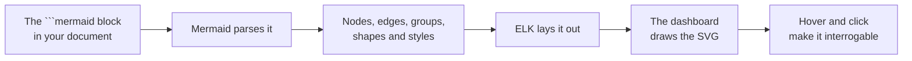
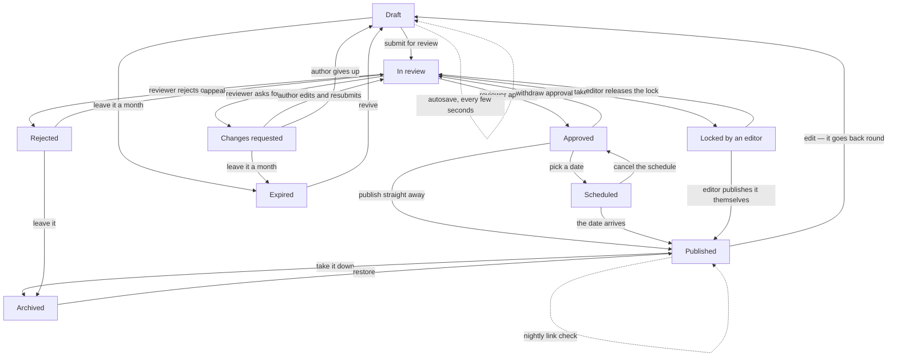
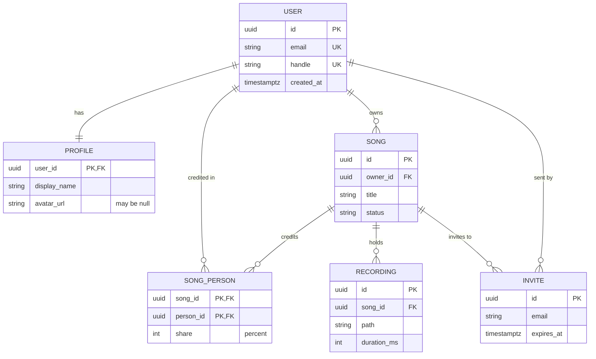
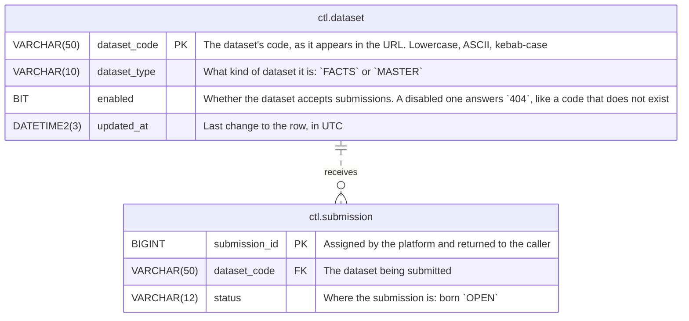
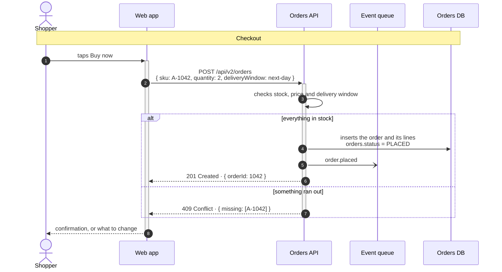

# DIAGRAMS

> Why a dense flowchart is normally unreadable, why an ER diagram is worse, why a sequence diagram
> with real payloads ends up too small to read, what this dashboard does about all three, and how to
> write diagrams that come out well. The short version: flowcharts, ER and sequence diagrams are
> laid out and drawn here rather than by Mermaid, entities are drawn as real tables, and the reader
> can interrogate the result rather than squint at it.

---

## 1. The problem this solves

Mermaid is an excellent way to *write* a diagram and a poor way to *read* a dense one. Its default
layout, dagre, does two things that fall apart as a chart grows:

- **It routes edges as free curves.** Two arcs that pass near each other become impossible to
  follow apart, and an arc that sweeps across the drawing crosses everything in its way.
- **It places an edge label at the middle of the edge, and hopes.** Nothing reserves space for the
  label. On a busy chart, labels land on top of one another, on top of other arcs, and — worst of
  all — nearer a stranger's arc than their own.

That last one is the failure that matters. When six arrows run down the page and six labels sit
among them, *which text belongs to which arrow* becomes a guess. A diagram that has to be guessed
at is not a diagram; the reader gives up and reads the paragraph instead, which is the one thing
the diagram was there to save them.

An ER diagram inherits both of those and adds a third of its own. An entity is a table — a type, a
name, sometimes a key or a comment, repeated down the box — and mermaid draws it as a grid of boxed
cells. Nothing lines up between one entity and the next, the borders weigh more than the words
inside them, and a key is text in a cell rather than something the eye can pick out. The question a
reader actually brings to a schema — *which column is the primary key here, and which ones point
somewhere else* — ends up having to be answered by reading every row.

## 2. What the dashboard does instead

Flowcharts and ER diagrams go through a different pipeline (sequence diagrams have their own, in
[section 5](#sequence)):



Mermaid still does the parsing, so every bit of syntax it understands keeps working and there is
no second dialect to learn. What changes is the layout and the drawing.

### <a id="why-elk"></a>2.1 Why ELK

ELK's *layered* algorithm is built for exactly this shape of graph, and it fixes the three failures
above at the source rather than patching them afterwards:

| | dagre, as Mermaid uses it | ELK, as used here |
|---|---|---|
| Edge routing | free curves | **orthogonal** — straight runs, right-angle bends, shared lanes |
| Edge labels | placed after the fact, at the midpoint | **first-class layout objects** — the algorithm reserves room for each one |
| Crossings | a side effect | a minimisation objective |

Reserved label space is the important row. Because a label occupies real estate in the layout,
nothing is ever placed on top of it, and it is never dropped onto a stranger's arc. The text stops
colliding — with other text, and with the lines.

### 2.2 The label tie

Layout alone still leaves one ambiguity: six parallel arcs, six labels beside them, each correctly
spaced and each *near* its own arc. Near is not the same as unmistakable.

So every edge label is also tied to its arc by a hairline ending in a **dot sitting on that arc**.
The dot is the answer to "which arrow is this on" — not a hint, a fact. In practice you stop
noticing the ties and simply read the chart.

### 2.3 Hovering and pinning

The last resort is interrogation, and it is the one that makes genuinely dense charts tractable:

- **Hover an arrow or its label** — the arrow, its text, *and the two boxes at either end* light
  up while everything else fades. You read the whole transition at once: from here, doing this,
  to there.
- **Hover a box** — the box lights up along with every arrow that touches it and the box at the
  far end of each one. This is how you answer "what leads here, and where does this go" without
  tracing a line with your finger.
- **Click** to pin that state so it survives the mouse moving away, which is what you want while
  reading the paragraph beside the diagram. **Esc**, or a click on empty space, releases it.

Hover and pin work in the [full-size view](./4.%20READING.md#full-size) too.

## 3. A dense chart, as an example

Twelve boxes and twenty-four labelled transitions — the size at which the old rendering became
unreadable. Hover any arrow.



Compare it against the old rendering with the **Mermaid layout** button in the header of the
diagram. The comparison is the argument.

## <a id="er"></a>4. ER diagrams

An `erDiagram` goes through the same pipeline, for the same reasons: relationships get orthogonal
routes and reserved label space, and the role name on a relationship is tied to its own line by the
same hairline and dot. Three things are specific to ER.

### 4.1 The entity is a table

Not a grid of boxed cells — a table. The type and the name are columns, measured across the whole
entity so they line up; the keys are pinned to the right-hand edge, so **PK**, **FK** and **UK**
form a column of their own that the eye can run down without reading anything else; a comment sits
after the name in italics, where it stays out of the way. The name of the entity gets a header band
rather than another row. Hovering a row lights it end to end, which is what keeps you on one line
while you travel from the type on the left to the keys on the right.

### 4.2 Crow's feet, at both ends

Cardinality is drawn where it belongs — against the entity — in the standard notation: a bar for
*one*, a circle for *zero*, a three-pronged foot for *many*. The marks are placed in the order the
source reads them. In `A }o--|| B` the `}` is the mark nearest `A` and the `o` the one beyond it,
which is exactly how they come out.

A non-identifying relationship (`..`) is drawn as a dashed line, an identifying one (`--`) solid.

### 4.3 Everything else carries over

`direction`, aliases (`p[Person]`), `subgraph`, and `classDef` / `class` colours all work, and so
does the hovering in [2.3](#23-hovering-and-pinning) — hover a relationship and both entities light
up with it; hover an entity and you get every relationship that touches it and the entity at the
far end of each. On a schema of any size that is the fastest way to answer *what joins to this*.



The **Mermaid layout** button in the header switches this one back, the same as it does for a
flowchart.

An ER diagram has no reading direction to keep, so it is shaped to the page rather than to its
source. A layered layout puts each step of a chain of relationships on a new row, and a schema
written top to bottom comes out as a tower, longer than a screen. So the diagram is laid out three
ways — as written, on its side, and on its side with a long chain folded into rows — and the one
that takes the **least height at the width of the column** is drawn, as long as its text is still
at least 80% of full size once fitted. The same diagram can take a different shape on a narrower
page: it is shaped again when the column's width changes. A `direction LR` or `RL` the source
writes is kept and may only be folded; an explicit `direction TB` is left as written.

### <a id="entity-sheet"></a>4.4 Everything a schema document says about a column

A diagram shows the shape of a schema; a schema document also says, for every column, whether it
can be null, what it defaults to, what it references and what it holds. Mermaid's ER syntax has
room for a type, a name, the keys and one comment — nothing else. So the rest is written in `%%`
lines, which Mermaid ignores: the same block still renders anywhere Mermaid does, and here it opens
up.



Every entity with more to say carries a button in the corner of its header. It **opens the entity
where it stands**: the compact table becomes the whole one, and the diagram is laid out again
around it. The entity keeps its place on the screen while the others glide to their new places, and
the same button closes it again. Any number can be open at once, and they stay open when the
diagram is drawn again, in the [full-size view](./4.%20READING.md#full-size) too.

| In the opened entity | Written as |
|---|---|
| Column, type, key | the attribute, as Mermaid spells it: `VARCHAR(50) dataset_code PK` |
| Length | from the type: `VARCHAR(50)` is `VARCHAR`, length `50`; `DECIMAL(5,2)` gives `5,2` |
| Description | the quoted comment |
| Null | `%% null` under the column — once any column in the diagram says so, a column that does not is `NOT NULL`, and a primary key always is |
| Default | `%% default SYSUTCDATETIME()` under the column |
| What a foreign key references | `%% references ctl.dataset` under the column |
| Constraints, or any other list, above the columns | `%%` lines directly under the entity's `{`: `- ` for each item, and the line just before the first item as its lead-in |

The other `%%` lines under the `{` say what the entity is for. That is not one of its columns, so it
is not in the table, open or not: it appears **while the pointer is on the entity's header**. In the
compact table, a column's description appears the same way **while the pointer is on its row**; an
opened entity already writes it out, so its rows say nothing more on hover.

Several settings can share a line, separated by `·` or `;` — `%% null · references ctl.dataset`.
Any other text under a column is added to its description. Backticks and `**bold**` are formatted.
**Never write a bare `%%`** with nothing after it: Mermaid's own parser fails on it.

In the compact table, short comments stay as before. Once any comment in a diagram is long — a
description rather than a note — every comment waits for the entity to be opened, so the compact
tables stay a schema you can take in at a glance. An opened entity is kept, where it can be, within
the width of the page: its descriptions wrap narrower rather than shrink the whole diagram.

## <a id="sequence"></a>5. Sequence diagrams

A sequence diagram fails differently. Nothing has to be routed — every message is a straight line
across the lanes — so the label problem above never arises. What breaks is **width**. Mermaid opens
each gap between two lifelines until the widest label crossing it fits, so a diagram whose messages
carry real payloads — a URL, a JSON body, a table name — comes out thousands of pixels wide, and is
then shrunk into the column until none of it can be read. The frames add their own trouble: the
conditions of an `alt` float loose inside it, and an `autonumber` is a dot too small to hold its
number.

So a sequence is laid out here, lane by lane, with Mermaid still doing the parsing:

- **It is laid out for the width it is shown at.** With room to spare, every label sits within
  its own arrow, labels get longer lines so they take fewer of them, and the lanes open up to fill
  the column — never so far that two participants end up a column apart. With too little room it
  goes the other way: long participant names wrap first, then message lines, and a label may
  overhang the ends of its own arrow, but never as far as the next lifeline out, so it still sits
  over one message and no other. Rows take the height their labels need instead of the diagram
  taking the width, and resizing the window lays it out again.
- **Labels wrap cleanly.** A path or a URL breaks after its own punctuation, and the lines of a
  label are balanced so none ends on a stranded word.
- **Frames are measured from what they hold.** `loop`, `alt`, `opt`, `par`, `critical` and `break`
  wrap exactly the messages inside them, each nested frame inset in its parent, with the keyword on
  a tab and the condition beside it. Every `else`, `and` and `option` line is named where it falls.
- **Numbers are badges** big enough to read, so the prose can say *steps 4 to 6* and the reader can
  find them.
- **Long diagrams keep their header.** The participants repeat at the foot, and while you scroll
  through the diagram their row rides along the top of the page, lane for lane.
- **Hovering works as it does everywhere else.** Hover a message and it lights up with the two
  participants at its ends; hover a participant — its box, or anywhere on its lifeline — and you
  get every message it sends or receives. Click to pin, **Esc** to release. The floating header
  row answers to the hover too.

Everything else carries over: `participant` and `actor`, aliases and `<br/>` in names, `box`
groups, notes left of, right of and over, activation bars (`+` / `-`, `activate`), `create` and
`destroy`, every arrow type — solid and dotted, open, cross, asynchronous `-)`, two-way — `rect`
highlights, `title`, and `autonumber` with a start, a step, or `off`.



The **Mermaid layout** button switches it back, as for the other two.

## 6. What still uses Mermaid's renderer

Everything else: state, class, gantt, pie, journey, git graph, mindmap and the rest.

Mermaid is also the fallback. If ELK is missing, or a chart uses something the clean renderer
cannot draw, that diagram quietly renders the mermaid way rather than failing. You will notice
because the button in the header will say **Clean layout** rather than **Mermaid layout**. A
sequence diagram does not need ELK, so it stays clean even without it.

## 7. Writing diagrams that come out well

The layout does the work. Four habits help it:

1. **Name the transition, not the mechanism.** `-->|"tap Save"|` reads. `-->|"POST /songs"|` does
   not, at least in a document meant for someone who does not write the code.
2. **Keep labels short.** One phrase, or two lines split with `<br/>`. A label of a dozen words or
   more is a sentence that escaped into the diagram — put it in the paragraph above and leave three
   words on the arrow.
3. **Quote every label.** `A["Start here"]` and `-->|"yes"|`. Unquoted labels break on punctuation
   in ways that are tedious to debug.
4. **Do not hand-tune the layout.** `linkStyle`, invisible spacer nodes, deliberately reordered
   statements to coax dagre — none of it applies here, and some of it makes the mermaid fallback
   worse. Write the graph; let the engine place it.

`classDef` and `class` for colour are respected; so are shapes, subgraphs, dotted (`-.->`) and
thick (`==>`) edges, and both arrow directions.

In an ER diagram the same rules apply to the role name on a relationship — `: places` reads,
`: fk_song_owner` does not — and one more: **declare the attributes you want read.** An entity
written with no `{ ... }` block is drawn as a plain named box, which is the right choice for a
diagram about how things relate and the wrong one for a diagram about a schema. Quote a comment
(`string note "free text"`), and give the keys as mermaid spells them: `PK`, `FK`, `UK`.

In a sequence diagram a message may carry more — the payload is often the point — but break it
where it breaks naturally, with `<br/>` between the call and its body, rather than leaving one long
line for the wrapping to cut. Mark phases with a note across every participant
(`Note over First,Last: 2 · Closing`), and prefer `autonumber` whenever the prose refers to steps.

## 8. Choosing the engine

Per diagram, from the page: the button in the header switches that one, for as long as the page is
open. It is there for comparing, not for changing the project's mind — a reload goes back to the
configured default.

Project-wide, in [the config](./3.%20CONFIGURATION.md#diagrams):

```json
{ "diagrams": { "engine": "mermaid" } }
```

or for one build, `docucane --engine mermaid`. Both engines ship in the page either way, so
the reader's button always works, online or not.

## Quick glossary

- **dagre** — the layout library Mermaid uses for flowcharts by default.
- **ELK** — the Eclipse Layout Kernel; its *layered* algorithm is what draws flowcharts and ER
  diagrams here.
- **Orthogonal routing** — edges drawn as straight runs joined by right angles, rather than curves.
- **Edge label** — the text on an arrow, written `-->|"like this"|`; on a relationship in an ER
  diagram, the role name written `: like this`.
- **Crow's foot** — the three-pronged mark meaning *many* at that end of a relationship.
