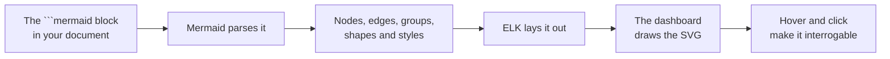
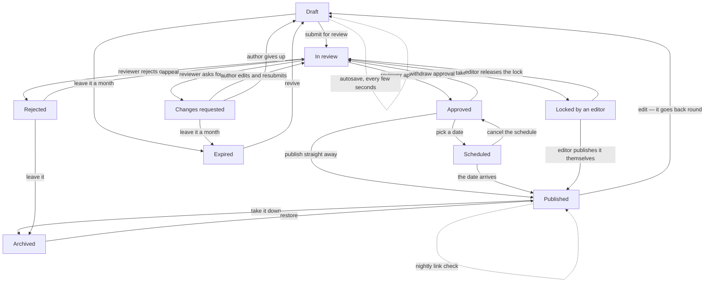

# DIAGRAMS

> Why a dense flowchart is normally unreadable, what this dashboard does about it, and how to
> write diagrams that come out well. The short version: flowcharts get a different layout engine
> from the one Mermaid ships with, and the reader can interrogate the result rather than squint
> at it.

---

## 1. The problem this solves

Mermaid is an excellent way to *write* a diagram and a poor way to *read* a dense one. Its default
layout, dagre, does two things that fall apart as a chart grows:

- **It routes edges as free curves.** Two arcs that pass near each other become impossible to
  follow apart, and an arc that sweeps across the drawing crosses everything in its way.
- **It places an edge label at the middle of the edge, and hopes.** Nothing reserves space for the
  label. On a busy chart, labels land on top of one another, on top of other arcs, and — worst of
  all — nearer a stranger's arc than their own.

That last one is the failure that matters. When six arrows run down the page and six labels sit
among them, *which text belongs to which arrow* becomes a guess. A diagram that has to be guessed
at is not a diagram; the reader gives up and reads the paragraph instead, which is the one thing
the diagram was there to save them.

## 2. What the dashboard does instead

Flowcharts — and only flowcharts — go through a different pipeline:



Mermaid still does the parsing, so every bit of flowchart syntax it understands keeps working and
there is no second dialect to learn. What changes is the layout and the drawing.

### <a id="why-elk"></a>2.1 Why ELK

ELK's *layered* algorithm is built for exactly this shape of graph, and it fixes the three failures
above at the source rather than patching them afterwards:

| | dagre, as Mermaid uses it | ELK, as used here |
|---|---|---|
| Edge routing | free curves | **orthogonal** — straight runs, right-angle bends, shared lanes |
| Edge labels | placed after the fact, at the midpoint | **first-class layout objects** — the algorithm reserves room for each one |
| Crossings | a side effect | a minimisation objective |

Reserved label space is the important row. Because a label occupies real estate in the layout,
nothing is ever placed on top of it, and it is never dropped onto a stranger's arc. The text stops
colliding — with other text, and with the lines.

### 2.2 The label tie

Layout alone still leaves one ambiguity: six parallel arcs, six labels beside them, each correctly
spaced and each *near* its own arc. Near is not the same as unmistakable.

So every edge label is also tied to its arc by a hairline ending in a **dot sitting on that arc**.
The dot is the answer to "which arrow is this on" — not a hint, a fact. In practice you stop
noticing the ties and simply read the chart.

### 2.3 Hovering and pinning

The last resort is interrogation, and it is the one that makes genuinely dense charts tractable:

- **Hover an arrow or its label** — the arrow, its text, *and the two boxes at either end* light
  up while everything else fades. You read the whole transition at once: from here, doing this,
  to there.
- **Hover a box** — the box lights up along with every arrow that touches it and the box at the
  far end of each one. This is how you answer "what leads here, and where does this go" without
  tracing a line with your finger.
- **Click** to pin that state so it survives the mouse moving away, which is what you want while
  reading the paragraph beside the diagram. **Esc**, or a click on empty space, releases it.

Hover and pin work in the [full-size view](./4.%20READING.md#full-size) too.

## 3. A dense chart, as an example

Twelve boxes and twenty-four labelled transitions — the size at which the old rendering became
unreadable. Hover any arrow.



Compare it against the old rendering with the **Mermaid layout** button in the corner of the
diagram. The comparison is the argument.

## 4. What still uses Mermaid's renderer

Everything that is not a flowchart: sequence, ER, state, class, gantt, pie, journey, git graph, and
the rest. Those types do not suffer the label problem — a sequence diagram has nowhere ambiguous to
put a message label — so there is nothing to gain by re-drawing them, and plenty of fidelity to
lose.

Mermaid is also the fallback. If ELK is missing, or a flowchart uses something the clean renderer
cannot draw, that diagram quietly renders the mermaid way rather than failing. You will notice
because the button in the corner will say **Clean layout** rather than **Mermaid layout**.

## 5. Writing diagrams that come out well

The layout does the work. Four habits help it:

1. **Name the transition, not the mechanism.** `-->|"tap Save"|` reads. `-->|"POST /songs"|` does
   not, at least in a document meant for someone who does not write the code.
2. **Keep labels short.** One phrase, or two lines split with `<br/>`. A label of a dozen words or
   more is a sentence that escaped into the diagram — put it in the paragraph above and leave three
   words on the arrow.
3. **Quote every label.** `A["Start here"]` and `-->|"yes"|`. Unquoted labels break on punctuation
   in ways that are tedious to debug.
4. **Do not hand-tune the layout.** `linkStyle`, invisible spacer nodes, deliberately reordered
   statements to coax dagre — none of it applies here, and some of it makes the mermaid fallback
   worse. Write the graph; let the engine place it.

`classDef` and `class` for colour are respected; so are shapes, subgraphs, dotted (`-.->`) and
thick (`==>`) edges, and both arrow directions.

## 6. Choosing the engine

Per diagram, from the page: the button in the corner switches that one, for as long as the page is
open. It is there for comparing, not for changing the project's mind — a reload goes back to the
configured default.

Project-wide, in [the config](./3.%20CONFIGURATION.md#diagrams):

```json
{ "diagrams": { "engine": "mermaid" } }
```

or for one build, `docucane --engine mermaid`. Both engines ship in the page either way, so
the reader's button always works, online or not.

## Quick glossary

- **dagre** — the layout library Mermaid uses for flowcharts by default.
- **ELK** — the Eclipse Layout Kernel; its *layered* algorithm is what draws flowcharts here.
- **Orthogonal routing** — edges drawn as straight runs joined by right angles, rather than curves.
- **Edge label** — the text on an arrow, written `-->|"like this"|`.
